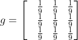
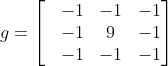

<div align="center">
<b>卷积</b>
</div>

<b><details><summary>📚说明</summary></b>
卷积运算详解
</details>

## 📑 目录

* [🏘️卷积运算基础概念](#gainian)

<a id="gainian"></a>
卷积运算过程图解(绿色区域为输入矩阵，红色字体为卷积核，粉色区域为输出，T(x)=F(x)*G(x))：
<div align="center">


</div>

卷积的实际意义：<b>在图像处理的中，卷积处理的结果，其实就是把每个像素周边的，甚至是整个图像的像素都考虑进来，对当前像素进行某种加权处理,如果是"平滑"卷积核，则图像变得更为平滑，显得更模糊。如果是"锐化"卷积核将使得像素值变化明显的地方更为明显，强化边缘，而变化平缓的地方没有影响。</b>

具体算式过程如下：
```cpp
// 当使用一个3x3的卷积核对一个4x4的输入图像进行卷积运算时，让我们展示每一步的计算过程。

// 输入图像矩阵：
1  2  3  4
5  6  7  8
9 10 11 12
13 14 15 16

// 卷积核矩阵：
0  1  0
1 -4  1
0  1  0

// 翻转卷积核矩阵（先沿x轴翻转再沿y轴翻转，或者先翻y后翻x）
0  1  0
1 -4  1
0  1  0

// 第一行第一列的输出像素值：
(1*0) + (2*1) + (3*0) +
(5*1) + (6*-4) + (7*1) +
(9*0) + (10*1) + (11*0)
= -16
// 第一行第二列的输出像素值：
(2*0) + (3*1) + (4*0) +
(6*1) + (7*-4) + (8*1) +
(10*0) + (11*1) + (12*0)
= -12
// 第一行第三列的输出像素值：
(3*0) + (4*1) + (0*0) +
(7*1) + (8*-4) + (0*1) +
(11*0) + (12*1) + (0*0)
= -12
// 第一行第四列的输出像素值：
(4*0) + (0*1) + (0*0) +
(8*1) + (0*-4) + (0*1) +
(12*0) + (0*1) + (0*0)
= -4

// 移动卷积核到第二行开始的位置，重复上述步骤1-4，计算第二行的输出像素值。

// 依此类推，完成整个输入图像的卷积运算，得到输出图像的所有像素值。

// 最终得到的输出图像矩阵（其中的值是根据卷积运算的计算结果）：
-16 -12 -12  -4
 -8   0   0   8
 -8   0   0   8
  4  12  12  16
```