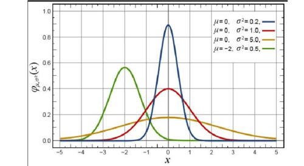
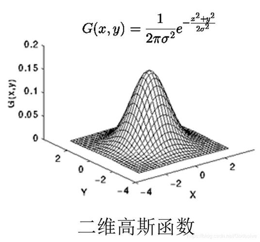

<div align="center">
<b>高斯函数</b>
</div>

<b><details><summary>📚说明</summary></b>
对高斯函数的一般形式、其中参数的基本意义以及具体使用场景的讲解。
</details>

## 📑 目录

* [🏘️高斯函数基础概念](#gainian)

<a id="gainian"></a>
一维高斯函数：<b>G(x) = A * exp(-((x - μ)^2) / (2 * σ^2))</b>
<div align="center">


</div>

 ```cpp
A: 是幅度（amplitude）或最大值，决定了图形高度。
μ: 是均值（mean），表示函数的中心位置。
σ: 是标准差（standard deviation），影响函数的宽度和分布的扩散程度。
exp: 表示自然指数,exp(2)=e^2
 ```

二维高斯函数：<b>G(x, y) = A * exp(-((x - μx)^2 + (y - μy)^2) / (2 * σ^2))</b>
<div align="center">


</div>