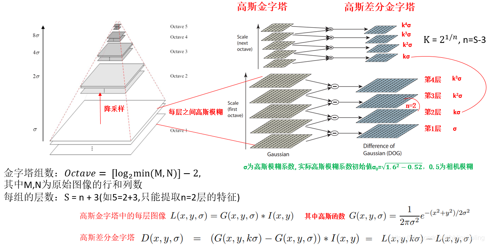
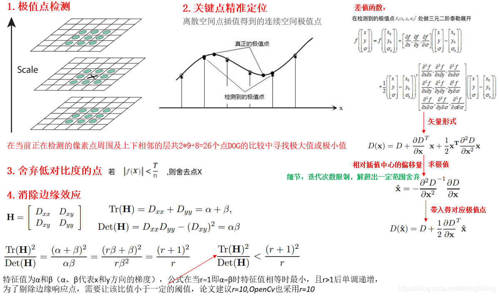
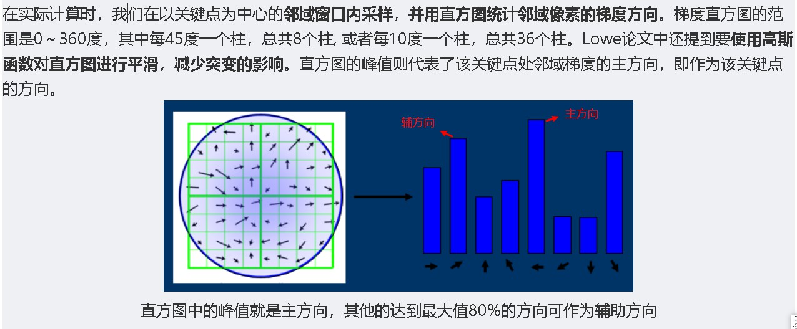
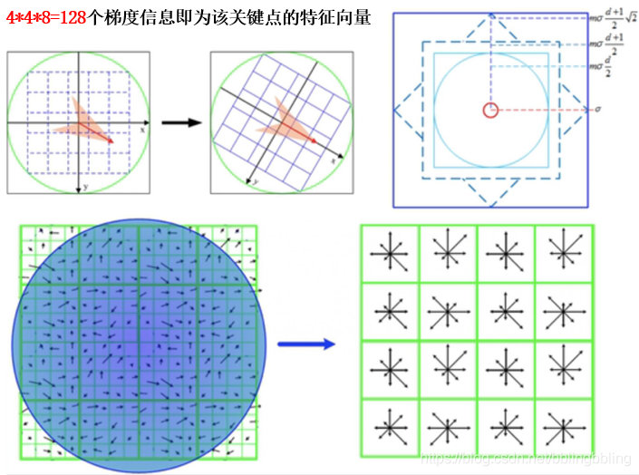
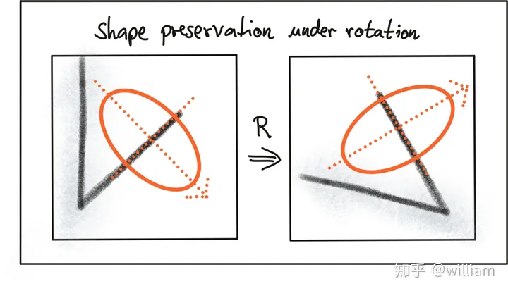
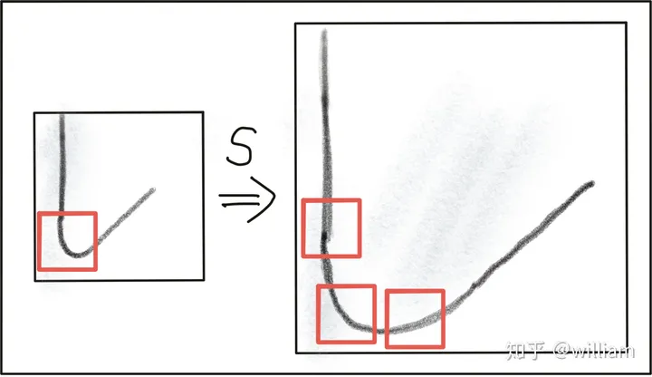
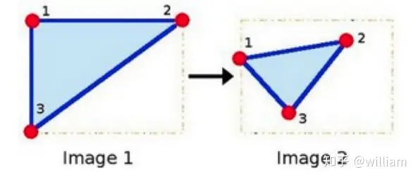
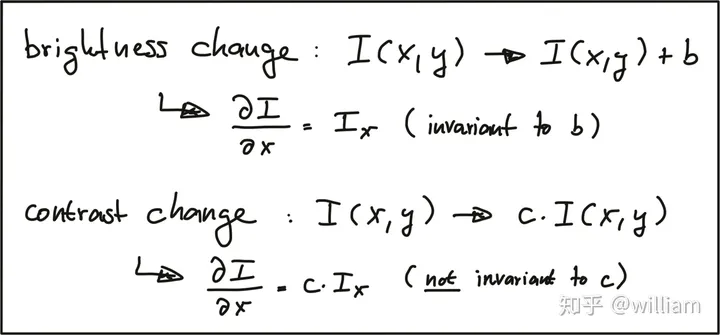

<div align="center">
<b>SIFT详解</b>
</div>

<b><details><summary>📚说明</summary></b>
对“SIFT”特征提取算法的详细原理步骤解读
</details>

## 📑 目录

* [🏘️SIFT概述](#gainian)
* [步骤1️⃣—构造高斯差分空间图像](#gjtx)
* [步骤2️⃣—寻找高斯差分图像中的极大极小值(亚像素点)](#jizhi)
* [步骤3️⃣—确定关键点主方向](#qdfx)
* [步骤4️⃣—构建描述子](#gjmsz)
* [一些图像几何变换不变性概念解释](#bbx)

🏘️SIFT概述
<a id="gainian"></a>

SIFT算法由D.G.Lowe 1999年提出，2004年完善总结。
SIFT (Scale-invariant feature transform)， 尺度不变特征转换，是一种图像局部特征提取算法，它通过在不同的尺度空间中寻找极值点（特征点，关键点）的精确定位和主方向，构建关键点描述符来提取特征。SIFT提取的关键点具有<b>尺度不变性、旋转不变性，而且不会因光照、仿射变换和噪音等因素而干扰</b>。SIFT所查找到的关键点是一些十分突出、不会因光照、仿射变换和噪音等因素而变化的点，如角点、边缘点、暗区的亮点及亮区的暗点等。

步骤1️⃣—构造高斯差分空间图像
<a id="gjtx"></a>
<div align="center">


</div>

步骤2️⃣—寻找高斯差分图像中的极大极小值(亚像素点)
<a id="jizhi"></a>
<div align="center">


</div>

步骤3️⃣—确定关键点主方向
<a id="qdfx"></a>
<div align="center">


</div>

步骤4️⃣—构建描述子
<a id="qdfx"></a>
```cpp 
1.将坐标轴旋转为特征点的主方向，以确保旋转不变性；
2.对于一个关键点产生128维的SIFT特征向量；
3.将特征向量的长度归一化，去除光照变化的影响。
```
<div align="center">


</div>

一些图像几何变换不变性概念的解释
<a id="bbx"></a>

线性变换：  
变换前是直线的，变换后依然是直线  
直线比例保持不变  
变换前是原点的，变换后依然是原点

仿射变换="线性变换"+"平移"（原点会改变）
<div align="center">


旋转不变性


尺度不变性


仿射不变性


亮度与对比度不变性
</div>