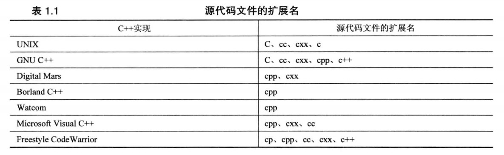
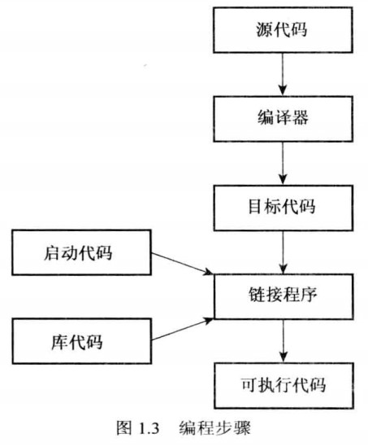

<div align="center">
<b> C++ Primer Puls Record </b>
</div>

## 快捷导航
* [编译器](#byq)
* [正式认识c++语法](#yf)

<a id="yxcx"></a>

### 运行第一个程序
```
// first_Program.cpp
int main() {return 0;}
```
<div align="center">


</div>

[编译器](#byq)：gcc first_Program.cpp

<div align="center">


</div>

<a id="byq"></a>
# 🏘️编译器分类
> 主流编译器有三大类：
## 1.GCC
* GNU Compiler Collection（GNU编辑工具合集）的缩写，用的最多，多平台兼容性最高,被认为是 C++ 标准的参考实现。考虑跨平台、兼容性、学习性的选它，没有啥条件的无脑选它。
### Windows版本
> 有三种选择
* Cygwin,功能比较齐全，但同时也比较笨重，可以在 Windows 上编译和运行许多 Unix 或 Linux 上的应用程。
* MinGW，轻量级，是直接使用 Windows 本地 API，而不是提供类 Unix 环境的兼容性。
* mingw-w64, MinGW 的一个分支，它专注于支持 64 位 Windows系统,如果是windows-64,选它。
> 所有版本都不单单提供有c++的编译器(g++)，也有c的编译器(gcc)注意不要用gcc去编译有c++独有库的cpp文件

### Linux版本
```cpp
sudo apt update
sudo apt install build-essential
// 验证：
gcc --version
g++ --version
```

## 2.Clang
* 基于LLVM的编译器前端,编译速度和错误信息提示方面表现出色,还提供了丰富的静态分析和代码重构工具，帮助开发者编写高质量的代码，需要静态分析或者代码重构的选它。

## 3.Microsoft Visual C++
* 主流的windows编译器，与VisualStudio软件绑定，如果确定只在windows平台开发使用c++那它是不二之选。
<a id="yf"></a>

## 正式认识c++语法
### 使用库文件
```
#include<iostream>
int main(){
	std::cout<<"Hello,World!";
	return 0;
```
如果计算机没有对应iostream库文件则无法运行编译好的程序

### 静态编译与动态编译
```
g++ -static -o 输出的文件名 cpp文件名 // 静态编译
g++ -static -o 输出文件名 cpp问价名 // 动态编译
```
交叉编译：下载对应的平台编译工具即可


