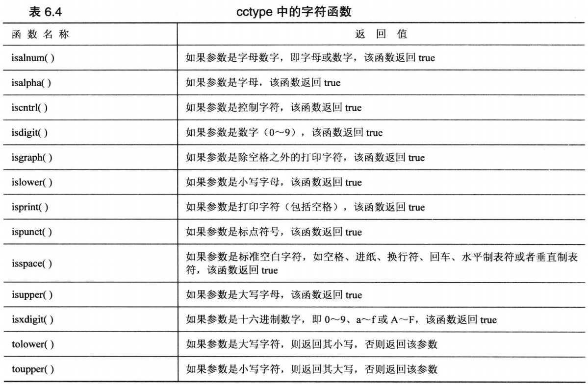

// 提供处理判断字符的函数和宏。

// 1. isalnum(c)：检查字符是否是字母或数字字符（字母或数字字符包括A-Z、a-z、0-9）。

// 2. isalpha(c)：检查字符是否是字母字符（A-Z、a-z）。

// 3. isdigit(c)：检查字符是否是数字字符（0-9）。

// 4. islower(c)：检查字符是否是小写字母字符（a-z）。

// 5. isupper(c)：检查字符是否是大写字母字符（A-Z）。

// 6. isspace(c)：检查字符是否为空白字符（空格、制表符、换行符等）。

// 7. isxdigit(c)：检查字符是否是十六进制数字字符（0-9、A-F、a-f）。

// 8. tolower(c)：将字符转换为小写字母字符（如果是大写字母字符的话）。

// 9. toupper(c)：将字符转换为大写字母字符（如果是小写字母字符的话）。