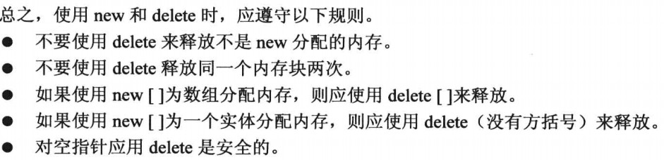

// 指针，我们在使用普通变量的时候，都是先确定了他的空间内存(也就是值)，然后编译器派生出它的地址。这是在编译阶段进行决策，在编译的时候就设定好了，运行时不能再改变，但是很多情况下我们是要在运行时决策的，例如一个数组，你用普通数组，那要多少长度才合适呢？答案是多长都不一定合适，少了怕不够用，多了怕浪费，最好的解决方案是在运行时决策，想要多长就给它多长。所以指针孕育而生，它与普通变量的策略刚好相反它先确定了地址，在运行时再动态派生出空间内存(具体值)。
// 两个地址要搞清楚，一个是指针自身的地址，也要占内存的，它跟普通变量一样，编译器会自动分配内存，储存在栈区或者全局/静态区，离开作用域会被自动销毁，另一个是指针里存储的地址值，该地址指向具体的变量值，它是存在堆的，这个值是没有提前的内存分配的，需要你在运行时给它。指针被销毁了，它不会被销毁，它还在堆上。所以为什么说有new，就一定要在当前作用域下把它delete掉，不然指针本身被删除，那它存储的在堆上的内存将无法被访问，也就无法被删除，直到进程结束才能销毁。很容易造成程序运行时的内存溢出。普通变量是地址+值，指针是本身的地址+存储的地址+存储的地址指向的值。还有，地址只是个标识符，不管多大的变量地址长度通常都相同，他们主要取决于计算机系统。
```cpp
// define
type *ptr;
// assign
int p;
int *ptr=&p;
// call
int p2;
p2=*ptr;
int *i = nullptr; // 指针可以为空
```
（1）除了引用，和函数类型外，所有类型都能使用指针，要想使用函数指针得遵循特殊的格式，具体看functionPtr.md介绍。


// 1.声明时要对每个指针名都要使用一个*
```cpp
int *ptr ,ptr2 // 这里则是声明了一个指针ptr,一个int变量ptr2。
```

// 2.指针与整数不能混为一谈，即使计算机通常把他当做整数处理，但是对地址的加减乘除，操作运算，毫无意义。我们不能直接将整数赋值给指针，而是要用小括号转化为对应类型指针再赋值。
```cpp
int *ptr;
ptr=(int *)0xB8000000;
```

// 3.一定要在使用指针时，确保指针已经初始化，也就是已经存有地址。
```cpp
int *ptr;
*ptr=2333; // ptr还没有存地址，直接解引用ptr会导致存储错乱，这个2333值会乱存，甚至会存储到不属于这个进程的空间，后果很严重！
/* 指针初始化方式总结如下 */
int x = 10;
int *ptr = &x; // 将指针直接初始化为变量 x 的地址

int *ptr1;
int *ptr2 = ptr1; // 通过赋值操作符初始化，将 ptr2 初始化为 ptr1 的值

int *ptr = new int; // 动态分配内存并将指针初始化为新分配内存的地址，记得delete

int *ptr = nullptr; // 将指针初始化为空指针,注意，初始化为空指针和直接int *ptr这种不初始化指针有本质的区别，当你使用一个nullptr指针时，编译是不会给你通过的，这能让我们在程序运行前就能预防空指针的引用，安全性更强。而不初始化的指针是可以悄无声息的通过编译的，到时候就会导致程序崩溃等严重后果。

```

// 4.使用new创建匿名变量（未被命名的内存），他们没有变量名，只有指向地址的指针名，new分配的内存与普通变量声明分配的内存不同，new分配的内促在堆上(堆是由程序员自己管理的)。使用完之后一定要delete，因为是在堆上，编译器不会帮你删除，所以new与delete都是成对使用。也不建议创建两个指向同一块内存的指针，可能会删除同一块内存两次。
```cpp
int *ptr =new int;  
// ......  
delete ptr; // delete只是释放内存，不会删除ptr本身，我们还可以给ptr赋予新的内存地址。    
int a;  
int *ptr =&a;  
delete ptr; // not allowed!,不能用delete释放声明变量时获得的内存（或者说new的内存才能用delete释放），它不在堆上，是在栈上。
```

// 5.new创建以及使用匿名动态数组，要想扩容，一般要新建个大数组，将小数组赋值给大数组，而后消除小数组内存，改变指针指向大数组。
```cpp
int *ptr=new int[10]; //*ptr是数组第一个元素，使用delete [] ptr 可以释放一个动态数组  
std::cout<<ptr[0]; // 指针直接可以当数组名使用，这是因为多数情况下,c++将数组名解释为数组第一个元素的地址.  
ptr=ptr+1; // 指针还可以进行算数运算，但是运算方式比较特别，并不是地址长度加一，而是直接指向了下一个元素，也就是加了对应类型的字节数，例如int,就加了4个字节。
```

// 6.使用new的基本准则：
<div align="center">


</div>

// 7.数组名与指针变量,
```cpp
int arr[10];
arr[1]==*(arr+1)； 
cout<<(int*)arr<<endl;// 在cout和多数c++表达式中，char数组名、char指针以及用括号括起的字符串常量，都被解释为字符串第一个字符的地址。在使用cout对hcar*进行打印时会先打印第一个字符，随后顺着打印其他字符直至碰到\0，打印结束，要打印地址要先将char*强制转换为int*。 

cout<<&arr[0]<<endl;
cout<<(int*)arr<<endl;
cout<<&arr<<endl;
//绝大多数情况下arr与&arr[0]等效(sizeof下就不等效了)，就是第一个元素的地址，而&arr则指向整个数组的指针地址，虽然他们地址数值相同，但类行与前两个不同。

const char *ch="hello"; // 直接使用双引号“”表示的是const 字符串类型，必须要const接收。

```

// 8.用new创建动态匿名动态结构。由于没有名字只有地址，所以不能用.来访问成员，要用箭头成员运算符“->”  
```cpp
struct person  
{  
    int age;  
    std::string name;  
};  
person *ps=new person;  
std::cout<<ps->age; // 使用->访问成员。或者使用(*ps).age
// ......
delete ps // 别忘了释放内存
```

// 9.多层指针（不会报错，但是尽量不要使用）
```cpp
int ***ptr3;
int **ptr2;
int *ptr;
ptr2=&ptr;
ptr3=&ptr2;
```

// 10.指针与二维数组
```cpp
int arr[][10]={{1,2,3},{4,5,6},{7,8,9}};
// 用指针如何接收
int (*ptr)[10]; // 括号不能省略，要放列的值。如果写成*ptr[10],则会变成指针数组，而不是指向数组的指针。
ptr=arr; // 之后的使用则直接用指针名即可
cout<<arr<<endl; // 输出的是第一个元素，也就是第一个数组的地址，那第一个数组地址存的还是第一个元素1的地址，所以两者存的地址相同，都是1的地址,arr属于指向指针的指针，不适合使用const。
cout<<*arr<<endl; // 与arr相同
cout<<**arr<<endl; // 1
```

// 指针判空的方式
```cpp
point=0/null // 不建议使用了，0和null本质上还是整数，会引发混淆
point=nullptr // 好理解，但是相对于if判断会有一点点冗长
if(point) // 简洁，但是可能有时不太好理解
```