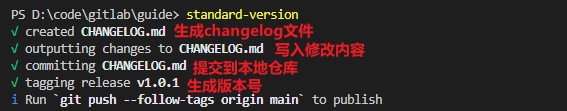
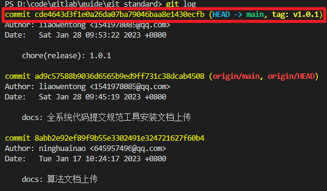

## 代码提交规范工具使用说明
### 一、提交命令
* 1.1将代码提交到缓存区
```
git add .  //提交当前目录下所有变更文件到缓存区
```
> git add对应的撤销操作  
git reset HEAD  //撤销上次的git add操作（不能连续撤销）  
git reset HEAD 文件名  //撤销对应文件的git add操作

* 2.2将代码提交到本地仓库
```
git cz  //提交当前缓存区下的所有文件到本地仓库
```
> git cz对应的撤销操作  
git reset --soft HEAD^  //git cz之后要撤销cz但是不撤销add，并且保留更改内容  
git reset --hard HEAD^  //git cz之后要撤销commit与add，并且删除更改内容(不可逆操作，谨慎使用)

* gitcz使用截图如下  
> 提交类型选择（必填）：上下箭头移动，回车键选择  
  

> 范围变化描述（可选）：  
  

> 提交内容描述描述（必填):  
  
> 该内容会显示在页面中，应该做到言简意赅，通俗易懂:  
  
> 剩下的命令都为可选项，根据具体项目要求填写，这里不在截图复述。
### 二、版本规范命令
```
standard-version  //自动创建/升级版本号，生成changelog,写入修改内容并提交文件到本地仓库
```
* 使用截图如下：  

### 三、推送到远程仓库
```
git push  //推送所有本地仓库文件以及版本标记到远程仓库
```
> git push对应的撤销操作：  
git log  //先查看push日志    
> commit后面的那一串数字就是唯一的提交的历史版本号（按Q可以退出gitlog查询）  
  
git reset --hard 版本号 //强制回退到该版本，删除工作空间改动代码，撤销commit，撤销git add，不可逆操作，谨慎使用！）

